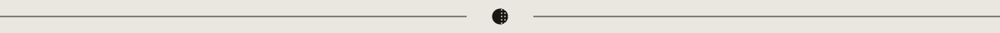

<p align="center">
  
</p>

<p align="center">
  <em>Websites with opinions, printed in code.</em>
</p>

<p align="center">
  
  
  <a href="https://github.com/Sakaax/halftone/actions"></a>
  <a href="https://halftone.sakaax.com"></a>
</p>

<p align="center">
  <code>01 / install</code>&nbsp;&nbsp;·&nbsp;&nbsp;
  <code>02 / workflow</code>&nbsp;&nbsp;·&nbsp;&nbsp;
  <code>03 / rules</code>&nbsp;&nbsp;·&nbsp;&nbsp;
  <code>04 / templates</code>&nbsp;&nbsp;·&nbsp;&nbsp;
  <code>05 / moods</code>&nbsp;&nbsp;·&nbsp;&nbsp;
  <code>06 / audits</code>&nbsp;&nbsp;·&nbsp;&nbsp;
  <code>07 / faq</code>
</p>



## <sub><code>— MANIFESTO</code></sub><br>The Claude Code plugin for award-tier web design.

Claude Code ships **shadcn-clean SaaS design** by default. Competent. Dead on arrival.

Halftone forces Claude into a **design-director mode**. It runs a brief, generates three art directions, builds a moodboard, locks a direction, scaffolds from slot-based templates, then codes components under **continuously-enforced anti-AI-slop rules**.

The goal: push Claude toward the editorial, motion-rich, asymmetric craft that wins Awwwards — or at least stops embarrassing you in a studio pitch.

> *No purple gradients. No Inter. No lorem ipsum. No apologies.*


## <sub><code>01 / INSTALL</code></sub><br>Three commands. One plugin.

**Step 1** — add the marketplace:

```
/plugin marketplace add Sakaax/halftone
```

**Step 2** — install the plugin:

```
/plugin install halftone@halftone
```

**Step 3** — kick off a site:

```
/halftone
```

That's it. Halftone takes over from there.


## <sub><code>02 / WORKFLOW</code></sub><br>Six steps. Zero AI-slop.

Halftone refuses to write code before you lock a direction. Period.

**`01`&nbsp;&nbsp;Brief** — 3 questions, hard cap. No *"describe your vision"*.

**`02`&nbsp;&nbsp;Directions** — three art directions dispatched in parallel. You pick, or you get three new ones.

**`03`&nbsp;&nbsp;Moodboard** — six images from `img-pilot`, or curated SVG fallbacks. Always shipped.

**`04`&nbsp;&nbsp;Lock** — `direction.md` committed. Now — and only now — code starts.

**`05`&nbsp;&nbsp;Scaffold** — slot-based composition. SvelteKit or Astro.

**`06`&nbsp;&nbsp;Code** — motion + typography + audit. Anti-slop rules re-read on every file write.


## <sub><code>03 / RULES</code></sub><br>Hardcoded, non-negotiable.

> [!WARNING]
> **Fonts banned, absolute** — Inter · Arial · Roboto · Helvetica Neue · Open Sans · Lato · Montserrat
>
> **Gradients banned** — purple-to-pink · rainbow · neon text glow
>
> **Colors banned as defaults** — Bootstrap primary blue · Tailwind defaults unmodified · Material palette
>
> **Motion banned** — random entry animations · bouncing arrows · auto-playing sliders · hover-scale on everything · fade-in-on-every-section
>
> **Layout banned** — centered hero + subtitle + button (no asymmetry) · dense SaaS-packed grids
>
> **Framework banned** — Next.js

> [!TIP]
> **Fonts allowed, whitelist** — Newsreader · PP Editorial New · Migra · Fraunces · Mondwest · PP Neue Montreal · Space Grotesk · JetBrains Mono · GT America · PP Right Grotesk
>
> **Moods available** — 7 curated palettes (see below)
>
> **Motion libs** — GSAP · Lenis · Motion One, reason-driven, `prefers-reduced-motion` gated, custom `cubic-bezier(0.76, 0, 0.24, 1)` easing

These rules live in `.claude/skills/halftone/SKILL.md` and are re-read on **every file write**.


## <sub><code>04 / TEMPLATES</code></sub><br>Six starters. Two frameworks.

| Format | Best for | Slots |
|---|---|---|
| **`studio-landing`** | Agency / studio sites. Unseen, Basement, Locomotive style. | hero · primary-motion · footer · *cursor* · *transition* |
| **`saas-premium`** | Linear, Vercel, Raycast style premium SaaS. | hero · primary-motion · footer · *cursor* |
| **`creative-portfolio`** | Designer / artist indie premium portfolios. | hero · primary-motion · footer · transition · *cursor* |

<sub>*italic slots are optional*</sub>

Every format ships in **both** SvelteKit and Astro. 3 formats × 2 frameworks = **6 templates**.

**Framework selection** is recommended per art direction:

- **SvelteKit** → dynamic SaaS · studio landings with heavy motion orchestration · client-state-heavy sites
- **Astro** → content-heavy portfolios · editorial + islands · SaaS with docs/blog built in

Always overridable with *"direction 2 but in Astro"*.


## <sub><code>05 / MOODS</code></sub><br>Seven curated. Forty-two fallback SVGs.

<table>
<thead>
<tr><th>Mood</th><th>Palette</th><th>Vibe</th></tr>
</thead>
<tbody>
<tr>
  <td><strong>Editorial Warm</strong></td>
  <td>
    
    
    
  </td>
  <td>Warm browns, creams, terracotta — editorial craft-forward</td>
</tr>
<tr>
  <td><strong>Brutalist Mono</strong></td>
  <td>
    
    
    
  </td>
  <td>Pure black/white + single accent — hard edges, type-dominant</td>
</tr>
<tr>
  <td><strong>Swiss Editorial</strong></td>
  <td>
    
    
    
  </td>
  <td>Off-white, ink black, saturated accent — type-driven, grid-first</td>
</tr>
<tr>
  <td><strong>Organic Earth</strong></td>
  <td>
    
    
    
  </td>
  <td>Olive, clay, bone, sage — organic shapes, hand-crafted</td>
</tr>
<tr>
  <td><strong>Y2K Glitch</strong></td>
  <td>
    
    
    
  </td>
  <td>Chrome, electric blue, hot pink — retro-tech <em>(explicit brief only)</em></td>
</tr>
<tr>
  <td><strong>Dark Academic</strong></td>
  <td>
    
    
    
  </td>
  <td>Deep forest, aged parchment, burgundy — literary, patinated</td>
</tr>
<tr>
  <td><strong>Soft Pastel Print</strong></td>
  <td>
    
    
    
  </td>
  <td>Muted risograph pastels — hand-craft, editorial print vibe</td>
</tr>
</tbody>
</table>

When `img-pilot` isn't installed, Halftone falls back to **42 hand-curated SVGs** (7 moods × 6 briefs: hero-bg · texture · ambient · detail · portrait · abstract).


## <sub><code>06 / AUDITS</code></sub><br>WCAG 2.1 AA, two passes.

**Static** — fast, no deps. CSS AST + HTML parse. Runs in ~200ms.

```
/halftone audit
```

Checks: `clamp()` type tokens · 48px tap targets · viewport meta · `prefers-reduced-motion` gating · `loading="lazy"` · alt text · `<html lang>` · focus-visible outlines · skip-link · palette contrast · semantic landmarks (`nav` / `main` / `footer`).

**Deep** — Playwright + axe-core, opt-in. Installs Playwright on-demand.

```
/halftone audit --deep
```

Launches chromium in mobile viewports (375 · 390 · 414px), measures real DOM tap-targets, tests nav-overlay interaction, runs full WCAG 2.1 AA axe-core analysis grouped by impact (critical/serious → fail · moderate/minor → warn).

Reports land in `halftone/audit/responsive.md` and `halftone/audit/a11y.md` (same schema).


## <sub><code>07 / ECOSYSTEM</code></sub><br>Composes with the pilot family.

<table>
<thead>
<tr><th>Plugin</th><th>Role</th><th>Halftone integration</th></tr>
</thead>
<tbody>
<tr>
  <td><a href="https://ux-pilot.sakaax.com"><strong>ux-pilot</strong></a></td>
  <td>UX discovery & flows</td>
  <td>Reads <code>ux-pilot/ux-brief.md</code> — skips Q1 of the brief</td>
</tr>
<tr>
  <td><a href="https://brand-pilot.sakaax.com"><strong>brand-pilot</strong></a></td>
  <td>Brand guardian</td>
  <td>Reads <code>brand-pilot/brand-kit.md</code> — fixes palette, constrains typography</td>
</tr>
<tr>
  <td><a href="https://img-pilot.sakaax.com"><strong>img-pilot</strong></a></td>
  <td>AI image generation</td>
  <td>Called for moodboards + hero imagery — falls back to SVGs if absent</td>
</tr>
</tbody>
</table>

Halftone sits **outside** the `*-pilot` family on purpose. It's a next-step product, not a sibling.


## <sub><code>08 / SECURITY</code></sub><br>Triple-layer, at write-time.

Halftone is a plugin that writes files to your disk and (optionally) handles API keys for `img-pilot`. Defenses shipped in v0.1:

- **Auto-gitignore** — `halftone/` paths appended to your `.gitignore` on first run (idempotent)
- **chmod 600** on key files (`halftone/.keys`, `halftone/.env`)
- **Pre-commit hook** — scans staged diffs for API key patterns (`sk-` · `AIza` · `api_key = "..."` · `IMG_PILOT_KEY=` · `RUNWAY_API_KEY=` · `KLING_`)
- **FS scope enforcer** — writes restricted to whitelist (`halftone/` · `src/halftone-generated/` · `static/` · `public/` · `package.json` append · `.gitignore` append)
- **Prompt-injection filter** — scans `direction.md` / `brief.md` for known injection patterns before passing to Claude
- **Pattern integrity** — sha256 per pattern in `patterns/index.json`, verified at runtime
- **Dependency pinning** — exact versions only, no `^`, no `~`
- **CSP starter templates** — nonce-based, no `unsafe-inline` for scripts
- **No runtime code fetching** — patterns, moods, fonts all ship in the release tarball

Full threat model → [`SECURITY.md`](SECURITY.md)


## <sub><code>09 / STACK</code></sub><br>The plugin vs. the output.

**Halftone itself:** TypeScript 5.8 · Bun runtime (Node fallback) · Zod validation · `gray-matter` · `postcss` · `node-html-parser` · `playwright` (peer dep)

**Generated sites:** SvelteKit 2.x *or* Astro 4.x · GSAP 3.x · Lenis · Motion One · self-hosted fonts · vanilla CSS with custom design tokens (no Tailwind utility soup · no shadcn)


## <sub><code>10 / COMMANDS</code></sub><br>Full reference.

```
/halftone                     Start the full director workflow
/halftone direction           Re-generate 3 fresh art directions
/halftone moodboard           Re-run moodboard for current direction
/halftone audit               Static audit (responsive + a11y)
/halftone audit --deep        Full audit with Playwright + axe-core
/halftone mood list           List 7 curated moods
/halftone hook install        Install pre-commit API-key scanner
/halftone hook uninstall      Remove it
/halftone status              Show current workflow state
```


## <sub><code>11 / FAQ</code></sub>

**Is my generated site AGPL-3.0 too?**
No. AGPL-3.0 covers Halftone's plugin source only. Your generated sites can use any license — MIT, proprietary, whatever.

**Does it work with Next.js?**
No. Next.js is banned explicitly. SvelteKit + Astro only. No plans to add Next.js.

**Video / animations?**
Not in v0.1. No Runway/Kling/ffmpeg integration. v2+ consideration.

**What if `img-pilot` isn't installed?**
Halftone runs end-to-end on 42 curated SVG fallbacks. Full generated site, placeholder moodboards instead of AI-generated ones.

**What if my brand-kit uses Inter?**
Halftone warns you loudly during the brief phase. Either accept drift, or update your brand-kit to a whitelisted font.

**How do paid fonts work?**
Halftone does NOT ship paid fonts (PP Editorial New · Migra · GT America · PP Right Grotesk). Scaffold emits `halftone/README-fonts.md` with purchase URLs + expected filenames. Fallback stack kicks in until you drop the WOFF2.

**Next.js support ever?**
Unlikely. The ban is ideological.


## <sub><code>12 / ROADMAP</code></sub>

**v0.2 candidates** — more pattern slugs · live API pricing in dry-run · mood pack extensions · community pattern contribution flow · video hero support (if demand)

**v0.3+** — more auto-fix audit coverage · visual regression baselines · Remix / Nuxt (*maybe*) · mobile-native (if a craft story emerges)


## <sub><code>— LINKS</code></sub>

- **Landing** — [halftone.sakaax.com](https://halftone.sakaax.com) *(coming soon)*
- **Ecosystem** — [ux-pilot](https://ux-pilot.sakaax.com) · [brand-pilot](https://brand-pilot.sakaax.com) · [img-pilot](https://img-pilot.sakaax.com)
- **Issues** — [github.com/Sakaax/halftone/issues](https://github.com/Sakaax/halftone/issues)
- **Maker** — [@sakaaxx](https://twitter.com/sakaaxx) · [github.com/Sakaax](https://github.com/Sakaax)


## <sub><code>— LICENSE</code></sub>

[AGPL-3.0](LICENSE).

Halftone's plugin code must stay open-source if redistributed or hosted as a service. **Your generated sites can use any license you want** — MIT, proprietary, all rights reserved, whatever. The copyleft applies to Halftone, not to its output.

<br>

<p align="center">
  
</p>

<p align="center">
  <sub><em>Websites with opinions, printed in code.</em></sub>
  <br>
  <sub><code>halftone v0.1.0 — crafted with halftone itself — agpl-3.0 — 2026</code></sub>
</p>
