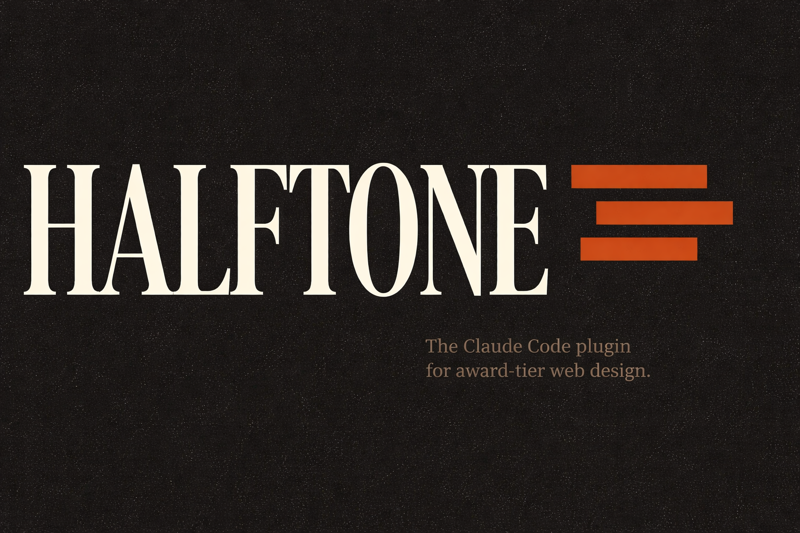

<p align="center">
  
</p>

<h1 align="center">Halftone</h1>

<p align="center">
  <strong>The Claude Code plugin for award-tier expressive web design.</strong><br>
  No shadcn. No Inter. No purple gradients.
</p>

<p align="center">
  <a href="https://www.gnu.org/licenses/agpl-3.0"></a>
  <a href="https://github.com/Sakaax/halftone/actions"></a>
  <a href="https://halftone.sakaax.com"></a>
  
</p>

<p align="center">
  <a href="#install">Install</a> ·
  <a href="#the-6-step-workflow">Workflow</a> ·
  <a href="#whats-banned-whats-allowed">Anti-slop rules</a> ·
  <a href="#templates--formats">Templates</a> ·
  <a href="#the-7-moods">Moods</a> ·
  <a href="#ecosystem">Ecosystem</a> ·
  <a href="#faq">FAQ</a>
</p>

---

## Why Halftone

Claude Code by default ships **shadcn-clean SaaS design**. Competent. Dead on arrival.

Halftone forces Claude into a **design-director mode**: it runs a brief, generates 3 art directions, builds a moodboard, locks a direction, scaffolds from slot-based templates, then codes components under **continuously-enforced anti-AI-slop rules**.

The goal: push Claude toward the editorial, motion-rich, asymmetric craft that **wins Awwwards** — or at least stops embarrassing you in a studio pitch.

<p align="center">
  <em>— 3-question brief → 3 directions → moodboard → lock → scaffold → code —</em>
</p>

---

## Install

**Step 1** — add the marketplace:

```
/plugin marketplace add Sakaax/halftone
```

**Step 2** — install the plugin:

```
/plugin install halftone@halftone
```

**Step 3** — kick off a site:

```
/halftone
```

That's it. Halftone takes over from there.

---

## What it ships

| Layer | What you get |
|---|---|
| **2 frameworks** | SvelteKit **and** Astro (both v0.1 first-class) |
| **3 formats** | Studio / agency landing · Premium SaaS · Creative portfolio |
| **6 templates** | 3 formats × 2 frameworks, slot-based composition |
| **9 patterns** (v0.1) | Heroes, text reveals, transitions, cursors, scroll-triggers, footers |
| **7 moods** | Curated palettes + typography pairings (editorial-warm, brutalist-mono, swiss-editorial, organic-earth, y2k-glitch, dark-academic, soft-pastel-print) |
| **42 fallback SVGs** | Moodboard placeholders when `img-pilot` isn't installed |
| **6 free fonts bundled** | Newsreader, Fraunces, Space Grotesk, JetBrains Mono, PP Neue Montreal (free), Mondwest (free) |
| **Motion stack** | GSAP + Lenis + Motion One, reason-driven, `prefers-reduced-motion` gated |
| **Audits** | WCAG 2.1 AA (static + optional axe-core via Playwright `--deep`) |
| **Security layer** | Auto-gitignore + chmod 600 + pre-commit hook + FS scope enforcer + prompt-injection filter |

---

## The 6-step workflow

Halftone refuses to write code before you lock a direction. Period.

### 1 — Brief _(3 questions max, hard cap)_

```
Q1: Describe the client / product in one sentence, + what the site should achieve.
Q2: Pick a mood: [1] Editorial Warm [2] Brutalist Mono ... [8] surprise me.
Q3: Pick a format: [1] Studio landing [2] Premium SaaS [3] Creative portfolio.
```

If you have `ux-pilot/ux-brief.md` or `brand-pilot/brand-kit.md` already, questions are auto-skipped or pre-filled.

### 2 — Directions _(3 in parallel)_

Three subagents dispatch simultaneously. Each returns one complete art direction: mood · typography pair · framework recommendation · layout wireframe · motion language · patterns per slot · 3+ inspiration refs.

You pick one. If none fit, you get 3 fresh ones (no intra-direction iteration — that's how scope creep starts).

### 3 — Moodboard _(6 images)_

- If [`img-pilot`](https://github.com/Sakaax/img-pilot) is installed → AI-generated 6-image moodboard (hero-bg, texture, ambient, detail, portrait, abstract) with grain overlay.
- If not → 42 hand-curated SVG fallbacks (7 moods × 6 briefs) ship in-tree. Still full workflow, no dependencies required.

### 4 — Lock

Halftone writes `halftone/direction.md` (Markdown + YAML frontmatter). This becomes the source of truth for every file written downstream. State transitions to `locked`. Code-writing is now unblocked.

### 5 — Scaffold _(slot-based)_

- Copies `templates/<framework>/<format>/` to your project root.
- Detects slots (HTML comments: `<!-- slot:hero -->`).
- Resolves patterns from `direction.md`, verifies sha256, injects into slot positions.
- Bundles required fonts (WOFF2 copy to `static/fonts/`).
- Generates `@font-face` CSS and fluid `clamp()` type tokens.
- Any file with `halftone:locked` frontmatter is never overwritten.

### 6 — Code

Fills components under anti-slop enforcement. For every file written, Claude re-reads the rules. Banned-pattern drift triggers a warning + rollback proposal.

After coding, auto-runs `halftone audit` (static). `halftone audit --deep` runs the full Playwright + axe-core check on demand.

---

## What's banned, what's allowed

### ❌ Hardcoded bans

| Category | Banned |
|---|---|
| **Fonts** | Inter · Arial · Roboto · Helvetica Neue · Open Sans · Lato · Montserrat |
| **Gradients** | purple-to-pink · rainbow · neon text glow |
| **Colors** | Bootstrap primary blue (`#0d6efd`) · Tailwind defaults unmodified · Material palette |
| **Motion** | Random entry-animations · infinite bouncing arrows · auto-playing sliders · hover-scale on everything · fade-in-on-every-section |
| **Layout** | Centered hero + subtitle + button (no asymmetry) · dense SaaS-packed grids |
| **UI** | Emoji as icons · glassmorphism · neumorphism · stock photography aesthetic |
| **Framework** | **Next.js** (explicit ban — v0.1 ships SvelteKit + Astro only) |

### ✅ Whitelist

| Category | Allowed |
|---|---|
| **Typography (10)** | Newsreader · PP Editorial New · Migra · Fraunces · Mondwest · PP Neue Montreal · Space Grotesk · JetBrains Mono · GT America · PP Right Grotesk |
| **Moods (7)** | Editorial Warm · Brutalist Mono · Swiss Editorial · Organic Earth · Y2K Glitch · Dark Academic · Soft Pastel Print |
| **Motion libs** | GSAP · Lenis · Motion One |
| **Easing** | Custom `cubic-bezier(0.76, 0, 0.24, 1)` (never default `ease`) |
| **Typography scale** | `clamp()` fluid — never fixed px breakpoints |

These rules live in the main SKILL.md and are re-read on **every file write**.

---

## Templates & formats

Halftone v0.1 ships **6 templates** (3 formats × 2 frameworks). Each has 3–5 composition slots filled at scaffold time.

| Format | Slots | Best for |
|---|---|---|
| `studio-landing` | hero · primary-motion · footer · *cursor* · *transition* | Agency / studio sites. Unseen, Basement, Locomotive style. |
| `saas-premium` | hero · primary-motion · footer · *cursor* | Linear, Vercel, Raycast style premium SaaS. |
| `creative-portfolio` | hero · primary-motion · footer · transition · *cursor* | Designer / artist indie premium portfolios. |

_(italic slots are optional)_

### Framework selection

Halftone recommends a framework **per art direction**, based on the brief:

- **SvelteKit** → dynamic SaaS, studio landings with heavy motion orchestration, client-state-heavy sites
- **Astro** → content-heavy portfolios (many project pages), editorial + islands, SaaS with docs/blog built in

You can always override with `"direction 2 but in Astro"`.

---

## The 7 moods

Each mood ships a curated palette + typography options + fallback SVGs + motion affinity tags.

| Mood | Palette | Vibe |
|---|---|---|
| **Editorial Warm** | Warm browns, creams, terracotta | sakaax signature; editorial craft-forward |
| **Brutalist Mono** | Pure black/white + single accent | Hard edges, type-dominant |
| **Swiss Editorial** | Off-white, ink black, saturated accent | Type-driven, grid-first |
| **Organic Earth** | Olive, clay, bone, sage | Organic shapes, hand-crafted |
| **Y2K Glitch** | Chrome, electric blue, hot pink | Retro-tech (explicit brief only) |
| **Dark Academic** | Deep forest, aged parchment, burgundy | Literary, patinated |
| **Soft Pastel Print** | Muted risograph pastels | Hand-craft, editorial print vibe |

---

## Pattern system

Patterns are slot-composable micro-components. Each pattern ships in **both** SvelteKit and Astro variants (CI blocks drift).

### v0.1 patterns (9 slugs, 18 variants)

- **Heroes** — `asymmetric-editorial`, `brutalist-headline`
- **Text reveals** — `per-letter-gsap`, `marquee-infinite`
- **Transitions** — `fullscreen-takeover`
- **Cursors** — `magnetic-hover` (desktop only, `pointer: coarse` gated)
- **Scroll triggers** — `pinned-reveal` (IntersectionObserver, no GSAP dep)
- **Footers** — `editorial-outro`, `minimal-mono`

### Pattern integrity

Every pattern has a `meta.json` with framework + slot + tokens required + motion tags + mood compatibility. A static manifest (`patterns/index.json`) with **sha256 per entry** is regenerated at build time:

```
bun run build:index
```

CI asserts the manifest is up-to-date on every push.

---

## Audits

Halftone ships **4 auditors** behind `/halftone audit`:

### Static (default, fast, no deps)

```
/halftone audit
```

- **Responsive:** viewport meta, `clamp()` type tokens, 48px tap targets, `prefers-reduced-motion` gating, ``
- **A11y (WCAG 2.1 AA):** alt text on every ``, `<html lang>`, focus-visible outlines, skip-links, semantic landmarks (`<nav>`, `<main>`, `<footer>`), palette contrast ratios

### Deep (Playwright + axe-core, opt-in)

```
/halftone audit --deep
```

- Launches Playwright (chromium), opens the site in mobile viewports (375/390/414px)
- Measures real DOM tap-target sizes, horizontal scroll overflow, nav-overlay behavior
- Injects `@axe-core/playwright`, runs full WCAG 2.1 AA analysis, groups violations by impact (critical/serious → fail, moderate/minor → warn)

Reports land in `halftone/audit/responsive.md` and `halftone/audit/a11y.md` (frontmatter + checklist, same schema).

---

## Security

Halftone is a plugin that writes files to your disk and (optionally via img-pilot) handles API keys. Defenses shipped in v0.1:

- **Auto-gitignore** — `halftone/.state.json`, `halftone/.keys`, `halftone/moodboard/`, `halftone/audit/` appended to your `.gitignore` on first run (idempotent, preserves existing lines).
- **chmod 600** on key files (`halftone/.keys`, `halftone/.env`).
- **Pre-commit hook** — scans staged diffs for API key patterns (`sk-`, `AIza`, `api_key = "..."`, `IMG_PILOT_KEY=`, `RUNWAY_API_KEY=`, `KLING_`). Prompt-installed after first scaffold.
- **FS scope enforcer** — writes are restricted to `halftone/`, `src/halftone-generated/`, `static/`, `public/`, `package.json` (append), `.gitignore` (append). Anything else throws.
- **Prompt-injection filter** — scans `direction.md` / `brief.md` body text for known injection patterns (`ignore previous`, `you are now`, shell fences) before passing to Claude.
- **Pattern integrity** — sha256 per pattern in `patterns/index.json`, verified at runtime before loading.
- **Dependency pinning** — exact versions in `package.json` (no `^`, no `~`).
- **CSP starter templates** — nonce-based, no `unsafe-inline` for scripts.
- **No runtime code fetching** — all patterns, moods, fonts ship with the release tarball.

Full threat model + reporting guidelines → [SECURITY.md](SECURITY.md).

---

## Ecosystem

Halftone composes with (but does not require) the [Sakaax pilot ecosystem](https://github.com/Sakaax):

| Plugin | Role | How Halftone uses it |
|---|---|---|
| [**ux-pilot**](https://ux-pilot.sakaax.com) | UX discovery & flows | Reads `ux-pilot/ux-brief.md` if present — skips Q1 of the brief |
| [**brand-pilot**](https://brand-pilot.sakaax.com) | Brand guardian | Reads `brand-pilot/brand-kit.md` if present — fixes palette, constrains typography |
| [**img-pilot**](https://img-pilot.sakaax.com) | AI image generation | Called for moodboards + hero imagery — falls back to SVGs if absent |

Halftone sits **outside** the `*-pilot` family on purpose. It's a next-step product, not a sibling.

---

## Stack

**Plugin itself:**
- TypeScript 5.8 · Bun runtime (Node fallback) · Zod validation · `gray-matter` frontmatter · `postcss` CSS AST · `node-html-parser` · `playwright` (peer dep, opt-in)

**Generated sites:**
- SvelteKit 2.x **or** Astro 4.x
- GSAP 3.x · Lenis 1.x · Motion One
- Self-hosted fonts (no CDN hotlinking in production)
- Vanilla CSS with custom design tokens (no Tailwind default utility soup, no shadcn)

---

## Commands reference

```
/halftone
```
Start the full director workflow (brief → code).

```
/halftone direction
```
Re-generate 3 fresh art directions (re-run step 2).

```
/halftone moodboard
```
Re-run the moodboard step for the current direction.

```
/halftone audit
```
Static audit (responsive + a11y), fast, no deps.

```
/halftone audit --deep
```
Full audit with Playwright + axe-core. Installs Playwright on-demand.

```
/halftone mood list
```
List the 7 curated moods with previews.

```
/halftone hook install
```
Install the pre-commit API-key scanner hook.

```
/halftone hook uninstall
```
Remove it.

```
/halftone status
```
Show current workflow state.

---

## FAQ

**Is my generated site AGPL-3.0 too?**
No. AGPL-3.0 covers **Halftone's plugin source only**. Your generated sites can use any license — MIT, proprietary, whatever.

**Does it work with Next.js?**
No. Next.js is banned explicitly. SvelteKit + Astro only in v0.1. No plans to add Next.js.

**Video / animations?**
Not in v0.1. No Runway / Kling / ffmpeg integration. v2+ consideration. Sites can link to externally-hosted embeds post-generation.

**What if img-pilot isn't installed?**
Halftone runs end-to-end on 42 curated SVG fallbacks (7 moods × 6 briefs). You get a full generated site, just with placeholder moodboards instead of AI-generated ones.

**What if my brand-kit uses Inter?**
Halftone warns you loudly during the brief phase. Your options: (a) let the warning ride and accept drift from Halftone's whitelist; (b) update your brand-kit to use a whitelisted font.

**Is there a CLI outside Claude Code?**
Yes, a minimal one for CI / automation: `halftone status`, `halftone audit`, `halftone build:index`, etc. Primary UX is via Claude Code — the CLI is debugging / scripting only.

**How do paid fonts work?**
Halftone does NOT ship paid fonts (PP Editorial New, Migra, GT America, PP Right Grotesk). If your direction uses one, scaffold emits a `halftone/README-fonts.md` with purchase URLs + expected filenames. Until you drop the WOFF2, fallback stack kicks in.

**Can I extend with custom patterns?**
v0.1 locks the in-tree pattern set. v0.2 will ship a `patterns/` contribution convention with CI parity gates. Meanwhile, fork + add your patterns in a branch.

**Next.js support ever?**
Unlikely. The ban is ideological (AI-slop associations, Vercel lock-in ergonomics). We'd rather double down on SvelteKit + Astro excellence.

---

## Roadmap

**v0.2 candidates:**
- More pattern slugs (5–10 additional heroes, headers, text treatments)
- Live pricing for moodboard API calls (dry-run cost preview)
- Mood pack extensions (soft-brutalist, anti-design, maximalism)
- Pattern contribution flow (community PRs with parity CI)
- Video hero support (if demand materializes)

**v0.3+ / nice-to-have:**
- Auto-fix for more audit violations (more than alt, lang, focus)
- Visual regression baselines checked into repo
- Framework plugin: Remix (_maybe_), Nuxt (_maybe_), never Next.js
- Mobile-native stack (React Native Expo, if we find a craft story for it)

---

## Troubleshooting

**Fonts look off / fallback stack kicking in**
You're using a paid font that isn't dropped yet. Check `halftone/README-fonts.md` for purchase URLs + expected filenames. Drop the WOFF2 at the specified path.

**`bun run build:index` fails**
A pattern is missing one of the framework variants. Every pattern ships both `sveltekit` + `astro`. Check `patterns/<slot>/<framework>/<slug>/meta.json` exists for both.

**Pre-commit hook blocks a commit**
It found an API key pattern in your staged diff. Options: (a) remove the key from the diff; (b) if it's a false positive, the regex is grep-friendly, adjust `hooks/pre-commit.sh`; (c) **do not** bypass with `--no-verify` — the hook exists for a reason.

**`halftone audit --deep` complains about Playwright**
Install it on-demand:
```
bunx playwright install --with-deps chromium
```

**Claude keeps suggesting shadcn / Inter / Tailwind defaults**
Halftone's SKILL.md re-reads anti-slop rules on every file write. If Claude still drifts, file an issue with the transcript — this is a regression we want to fix.

---

## Contributing

See [CONTRIBUTING.md](CONTRIBUTING.md). Short version:

- Every pattern has **both** framework variants. PRs that update one must update the other.
- Run `bun run build:index` after pattern changes.
- Conventional Commits. Never `--amend` on public main.
- Be kind. Critique craft, not people.

---

## Links

- **Landing:** [halftone.sakaax.com](https://halftone.sakaax.com) _(coming soon)_
- **Ecosystem:** [ux-pilot](https://ux-pilot.sakaax.com) · [brand-pilot](https://brand-pilot.sakaax.com) · [img-pilot](https://img-pilot.sakaax.com)
- **Issues:** [github.com/Sakaax/halftone/issues](https://github.com/Sakaax/halftone/issues)
- **Maker:** [@sakaaxx](https://twitter.com/sakaaxx) · [github.com/Sakaax](https://github.com/Sakaax)

---

## License

[AGPL-3.0](LICENSE).

Halftone's plugin code must stay open-source if redistributed or hosted as a service. **Your generated sites can use any license you want** — MIT, proprietary, all rights reserved, whatever. The copyleft applies to Halftone, not to its output.

---

<p align="center">
  <sub>Crafted with Halftone itself. No shadcn was used in the making of this README.</sub>
</p>
